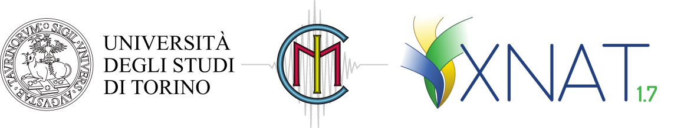
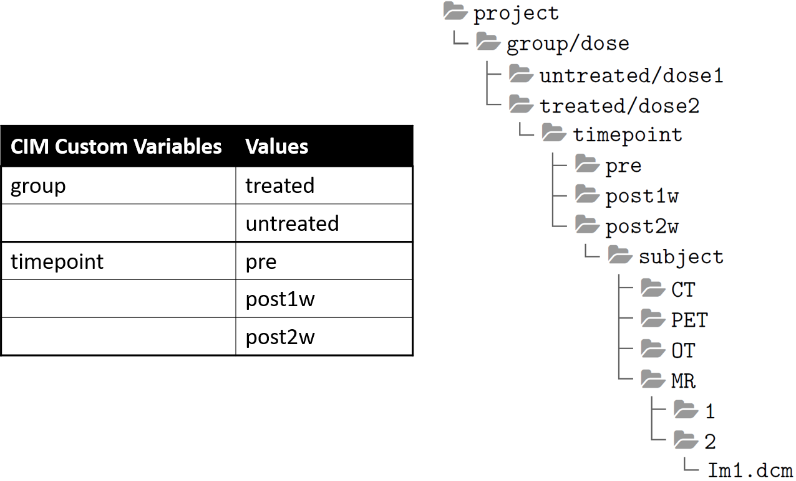
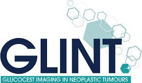

<!--
*** Thanks for checking out the Best-README-Template. If you have a suggestion
*** that would make this better, please fork the repo and create a pull request
*** or simply open an issue with the tag "enhancement".
*** Thanks again! Now go create something AMAZING! :D
-->


<!-- PROJECT SHIELDS -->
<!--
*** I'm using markdown "reference style" links for readability.
*** Reference links are enclosed in brackets [ ] instead of parentheses ( ).
*** See the bottom of this document for the declaration of the reference variables
*** for contributors-url, forks-url, etc. This is an optional, concise syntax you may use.
*** https://www.markdownguide.org/basic-syntax/#reference-style-links
-->

  [![Contributors][contributors-shield]][contributors-url]
  [![Forks][forks-shield]][forks-url]
  [![Stargazers][stars-shield]][stars-url]
  [![Issues][issues-shield]][issues-url]
  [![License][license-shield]][license-url]


<!-- PROJECT LOGO -->
<br />
<p align="center">
  <a href="https://github.com/szullino/XNAT-PIC">
    
  </a>

  <h3 align="center"><b>XNAT-PIC</b></h3>

  <p align="center">
    Extending XNAT to Preclinical Imaging Centers
    <br />
    <a href="https://github.com/szullino/XNAT-PIC"><strong>Explore the docs »</strong></a>
    <br />
    <br />
    <a href="https://github.com/szullino/XNAT-PIC">View Demo</a>
    ·
    <a href="https://github.com/szullino/XNAT-PIC/issues">Report Bug</a>
    ·
    <a href="https://github.com/szullino/XNAT-PIC/issues">Request Feature</a>
  </p>
</p>


<!-- TABLE OF CONTENTS -->
<details open="open">
  <summary>Table of Contents</summary>
  <ol>
    <li>
      <a href="#about-the-project">About</a>
      <ul>
        <li><a href="#built-with">Built With</a></li>
      </ul>
    </li>
    <li>
      <a href="#getting-started">Getting Started</a>
      <ul>
        <li><a href="#prerequisites">Prerequisites</a></li>
        <li><a href="#installation">Installation</a></li>
      </ul>
    </li>
    <li><a href="#usage">Usage</a></li>
    <li><a href="#roadmap">Roadmap</a></li>
    <li><a href="#contributing">Contributing</a></li>
    <li><a href="#license">License</a></li>
    <li><a href="#citation">Citation</a></li>
    <li><a href="#media">Media</a></li>
    <li><a href="#contact">Contact</a></li>
    <li><a href="#funding">Funding</a></li>
    <li><a href="#acknowledgements">Acknowledgements</a></li>
  </ol>
</details>


<!-- ABOUT THE PROJECT -->
# About

[![XNAT-PIC][xnat-pic-screenshot]](http://cim-xnat.unito.it/app/template/Login.vm)
**XNAT for Preclinical Imaging Centers (XNAT-PIC)** has been developed to expand XNAT's basic functionalities to preclinical imaging and consists of:
1. **MRI2DICOM**, a Magnetic Resonance Imaging (MRI) converter from ParaVision® (Bruker, Inc. Billerica, MA) file format to DICOM standard 
2. **XNAT-PIC Uploader** to import multimodal DICOM image datasets to XNAT
3. **XNAT-PIC Pipelines** for analysing single or multiple subjects within the same project in XNAT.


## Built With

XNAT-PIC has been built by using the following major frameworks:

* [XNAT](https://www.xnat.org/)
* [Python](https://www.python.org/)
* [MATLAB Engine API for Python](https://www.mathworks.com/help/matlab/matlab_external/get-started-with-matlab-engine-for-python.html)

<!-- GETTING STARTED -->
# Getting Started

This section contains instructions on **setting up XNAT-PIC** on your computer, in both Linux and Windows OS.<br>
Make sure you have the following softwares and packages in place:

* [XNAT 1.7.6](https://www.xnat.org/)
* [Python 3.7.6 and Python 2.7](https://www.python.org/)
* [Numpy 1.15.4](https://pypi.org/project/numpy/1.15.4/) and [Numpy 1.18.5](https://pypi.org/project/numpy/1.18.5/) 
* [pyAesCrypt 0.4.3](https://pypi.org/project/pyAesCrypt/0.4.3)
* [Pydicom 1.2.1](https://pypi.org/project/pydicom/1.2.1)
* [xnatpy 0.3.22](https://pypi.org/project/xnat/0.3.22)
* [pyxnat-1.2.1.0.post3](https://pypi.org/project/pyxnat/1.2.1.0.post3/)
* [Requests 2.23.0](https://pypi.org/project/requests/2.23.0)
* [opencv-python 4.4.0.40](https://pypi.org/project/opencv-python/4.4.0.40/)
* [nibabel 3.1.1](https://pypi.org/project/nibabel/3.1.1/)
* [dcmrtstruct2nii 1.0.19](https://pypi.org/project/dcmrtstruct2nii/1.0.19)
* [MATLAB Engine API for Python](https://www.mathworks.com/help/matlab/matlab_external/get-started-with-matlab-engine-for-python.html)

## Prerequisites
XNAT-PIC requires an XNAT instance to work with, therefore you first need to install XNAT on a local desktop or server. XNAT-PIC has been designed and tested for **XNAT 1.7.6**: we recommend to install this version. You can find the XNAT installation guide at the following link https://wiki.xnat.org/documentation/getting-started-with-xnat/xnat-installation-guide.
If you need help with the XNAT installation, please get in touch with us! <br>

## Installation

### MRI2DICOM and XNAT-PIC Uploader

1. Clone the repo
   ```sh
   git clone https://github.com/szullino/XNAT-PIC
   ```

2. Install [Python 3.7.6](https://docs.python.org/release/3.7.6/) or, alternatively, [Anaconda](https://www.anaconda.com/) 

Once you have Python up and running, you can install the following libraries. Again, we recommend to install the indicated versions as XNAT-PIC has not been tested to work with the latest releases.
For any issue, please contact us.

3. Install [Numpy 1.15.4](https://pypi.org/project/numpy/1.15.4/)

   ```sh
   pip install numpy==1.15.4
   ```

   
4. Install [pydicom 1.2.1](https://pypi.org/project/pydicom/1.2.1/)

   ```sh
   pip install pydicom==1.2.1
   ```
   

5. Install [xnatpy 0.3.22](https://pypi.org/project/xnat/0.3.22)

   ```sh
   pip install xnatpy==0.3.22
   ```

6. Install [pyAesCrypt 0.4.3](https://pypi.org/project/pyAesCrypt/0.4.3)

   ```sh
   pip install pyAesCrypt==0.4.3
   ```

###  XNAT-PIC Pipelines


1. Clone the repo
   ```sh
   git clone https://github.com/szullino/XNAT-PIC-pipelines
   ```

Follow these instructions to set up the XNAT-PIC Pipelines:

1. Create a [Python 2.7 virtual environment](https://docs.conda.io/projects/conda/en/latest/user-guide/tasks/manage-environments.html)

2. Install [Requests 2.23.0](https://pypi.org/project/requests/2.23.0)

   ```sh
   pip install requests==2.23.0
   ```

3. Install [pyxnat 1.2.1.0.post3](https://pypi.org/project/pyxnat/1.2.1.0.post3/)

   ```sh
   pip install pyxnat==1.2.1.0.post3
   ```
4. Install the [MATLAB Engine API for Python](https://www.mathworks.com/help/matlab/matlab_external/get-started-with-matlab-engine-for-python.html)

In particular, for the *Mask_Average* XNAT-PIC Pipeline you need to install Python 3.8.3 and the following libraries:

2. Install [numpy 1.18.5](https://pypi.org/project/numpy/1.18.5/)

   ```sh
   pip install numpy==1.18.5
   ```


3. Install [opencv-python 4.4.0.40](https://pypi.org/project/opencv-python/4.4.0.40/)

   ```sh
   pip install opencv-python==4.4.0.40
   ```

4. Install [nibabel 3.1.1](https://pypi.org/project/nibabel/3.1.1/)

   ```sh
   pip install nibabel==3.1.1
   ```

5. Install [dcmrtstruct2nii 1.0.19](https://pypi.org/project/dcmrtstruct2nii/1.0.19)

   ```sh
   pip install dcmrtstruct2nii==1.0.19
   ```


<!-- USAGE EXAMPLES -->
## Usage


### MRI2DICOM and XNAT-PIC Uploader

You can launch MRI2DICOM and the XNAT-PIC Uploader by running `launcher.py` in your Python IDE or via operating system command-line or terminal:

```
$ python launcher.py
```

Users can then click on **MRI2DICOM** to convert the ParaVision® (Bruker, Inc. Billerica, MA) raw data to DICOM standard  or on the **XNAT-PIC Uploader** to import the MR image sessions to XNAT, if your images are already in DICOM. In the first case, the converter needs to know the directory of the project in ParaVision® format. Once the process is over, a new folder with the DICOM images will be created in the same directory.

The DICOM image dataset can be then uploaded to XNAT. XNAT-PIC Uploader can upload a single subject or multiple subjects. You need to provide the XNAT webpage address and the login details. Then users can create a new project or select a pre-existing one in the drop-down menu, browse to the directory and type the number of custom variables. A pop-up window notifies the user once the process is complete. 

When uploading DICOM images to XNAT the user can also adopt a more complex structure that automatically sets **custom variables** (up to 3) and their values. For example, this data tree structure corresponds to the following custom variables and values:

<p align="center">
  <a >
    
  </a>

For more information about custom variables in XNAT, please visit: https://wiki.xnat.org/documentation/how-to-use-xnat/creating-and-managing-projects/adding-custom-variables-to-xnat-projects

### XNAT-PIC Pipelines
If you wish to use the pipelines developed in XNAT-PIC, you have two options accordingly to your profile:
1. generic XNAT users can sign up to our CIM-XNAT instance at http://cim-xnat.unito.it, upload the MR image datasets to be analyzed and add the pipelines to their own projects.<br>
_More information can be found here: [Adding Pipelines to your Project](https://wiki.xnat.org/documentation/how-to-use-xnat/adding-pipelines-to-your-project)_ 

2. XNAT admins can download the XNAT-PIC pipelines from https://github.com/szullino/XNAT-PIC-Pipelines, install and register them in their own XNAT instance.<br>
_More information can be found here: [Installing Pipelines in XNAT](https://wiki.xnat.org/documentation/xnat-administration/configuring-the-pipeline-engine/installing-pipelines-in-xnat)_<br>

In this second case, you need to create the following XNAT format config file, named `.central.cfg`, to be placed at a default location.
```
{"server": "your_xnat_url", "user": "user", "password": "your_xnat_password"}
```
The path of your `.central.cfg` file must be replaced in the following scripts `REST_XNAT_Getscans_bytype.py`, `download_project_scans_of_type.py`, and `upload_XNAT_files.py`.

To run a pipeline in XNAT, please follow this guide: https://wiki.xnat.org/documentation/how-to-use-xnat/running-pipelines-in-xnat <br>

This table shows a **list of the XNAT-PIC Pipelines** currently available:

| Name  | Description |
| ------------- | ------------- |
| Process_DWI  | Pipeline processes DWI map  |
| Process_DWI project  | Pipeline processes all DWI maps in a project  |
| Process_T1w_SR |	Pipeline processes T1 Saturation Recovery map |
| Process_T1w_SR_project	| Pipeline processes all T1 Saturation Recovery maps in a project |
| Process_T2w	| Pipeline processes T2 map |
| Process_T2w_project	| Pipeline processes T2 maps in a project |
| Mask_Average | Pipeline computes a mean value in a Region of Interest of a parametric map |


<!-- ROADMAP -->
## Roadmap

Please visit [open issues](https://github.com/szullino/XNAT-PIC/issues) for a list of proposed features (and known issues).


<!-- CONTRIBUTING -->
## Contributing

Contributions are **greatly appreciated**. <br>
If you wish to help us in improving the XNAT-PIC project, please follow these instructions.

1. Fork the Project
2. Create your Feature Branch (`git checkout -b feature/XNAT-PIC-new-feature`)
3. Commit your Changes (`git commit -m 'Add some XNAT-PIC-new-feature'`)
4. Push to the Branch (`git push origin feature/XNAT-PIC-new-feature`)
5. Open a Pull Request

Thank you!


<!-- LICENSE -->
## License

XNAT-PIC is distributed under the terms of the GNU General Public License (GPL) v3 or any later version as stated by the Free Software Foundation. See [`LICENSE`](https://github.com/szullino/XNAT-PIC-Readme/blob/master/LICENSE.txt) for more information.


<!-- CITATION -->
## Citation

Please, **cite these repositories** by using: <br>

* S. Zullino, A. Paglialonga, W. Dastrù, D. L. Longo, S. Aime. XNAT-PIC: Extending XNAT to Preclinical Imaging Centers, 2021. DOI: https://arxiv.org/abs/2103.02044

## News & Media

* "Demonstrator 5: XNAT-PIC: expanding XNAT for image archiving and processing to Preclinical Imaging Centers". EOSC-Life website, https://www.eosc-life.eu/d5/

* "Towards sharing and reusing of preclinical image data". Euro-Bioimaging website, https://www.eurobioimaging.eu/news/towards-sharing-and-reusing-of-preclinical-image-data/

* "Data Management: Biological and Preclinical Imaging Perspective". Euro-Bioimaging Virtual Pub, February 12th, 2021. <br>
[](https://youtu.be/QNiAGuFk53w "")

* "XNAT-PIC: expanding XNAT for image archiving and processing to Preclinical Imaging Centers". Demonstrator 5 from Populating EOSC-Life: Success stories for the Demonstrators – Session 1 from January 13, 2021.<br>
[](https://youtu.be/cpEcfIJJqCo "")
<!-- CONTACT -->
## Contact

**Sara Zullino, PhD** <br> [![LinkedIn][linkedin-shield]][linkedin-url] [![Publons][publons-shield]][publons-url] [![Twitter][twitter-shield]][twitter-url]<br>
Molecular Imaging Center<br>
Department of Molecular Biotechnology and Health Sciences <br>
<a  href="https://en.unito.it/">
     <br>
  </a>
  Via Nizza 52 | 10126 Torino, Italy<br>
sara.zullino@unito.it | T +39 011 670 9539 


<!-- ACKNOWLEDGEMENTS -->
## Funding

<a href="https://www.eurobioimaging.eu/">
     &nbsp;&nbsp;&nbsp;
  </a>

<a href="https://www.eosc-life.eu/">
    &nbsp;&nbsp;&nbsp;
  </a>

<a href="https://www.corbel-project.eu/home.html/">
     &nbsp;&nbsp;&nbsp;
  </a>

<a href="http://www.glint-project.eu/">
    
  </a>

## Acknowledgments

* Alessandro Paglialonga: https://github.com/pagli17
* Stefan Klein, Hakim Achterberg and Marcel Koek - Biomedical Imaging Group Rotterdam, Erasmus Medical Center, Rotterdam
* Matteo Caffini, “Project-Beat--Pyhton”: https://github.com/mcaffini/Project-Beat---Python


<!-- MARKDOWN LINKS & IMAGES -->
<!-- https://www.markdownguide.org/basic-syntax/#reference-style-links -->
[contributors-shield]: https://img.shields.io/github/contributors/szullino/XNAT-PIC
[contributors-url]: https://github.com/szullino/XNAT-PIC/graphs/contributors
[forks-shield]: https://img.shields.io/github/forks/szullino/XNAT-PIC
[forks-url]: https://github.com/szullino/XNAT-PIC/network/members
[stars-shield]: https://img.shields.io/github/stars/szullino/XNAT-PIC 
[stars-url]: https://github.com/szullino/XNAT-PIC/stargazers
[issues-shield]: https://img.shields.io/github/issues/szullino/XNAT-PIC
[issues-url]: https://github.com/szullino/XNAT-PIC/issues
[license-shield]: https://img.shields.io/github/license/szullino/XNAT-PIC
[license-url]: https://github.com/szullino/XNAT-PIC/blob/master/LICENSE.md
[linkedin-shield]: https://img.shields.io/badge/LinkedIn-blue/?style=flat&logo=linkedin&color=0088CC&labelColor=blue
[linkedin-url]: https://www.linkedin.com/in/sarazullino/
[publons-shield]: https://img.shields.io/badge/Publons-blue/?style=flat&logo=publons&color=0088CC&labelColor=blue
[publons-url]: https://publons.com/researcher/3602369/sara-zullino/
[twitter-url]: https://twitter.com/szullina
[twitter-shield]: https://img.shields.io/badge/Twitter-blue/?style=flat&logo=twitter&color=FFFFFF&labelColor=white
[xnat-pic-screenshot]: images/Fig1.png


